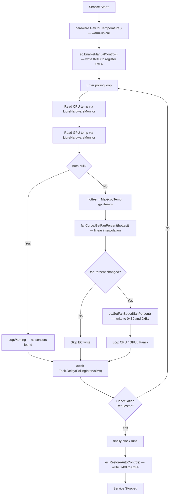

# WardOneZero Fan Control by Eduard Melik-Hakobyna

# 🌀 WardOneZero Fan Control


A lightweight, configurable Windows Background Service written in **C# (.NET 10)** that takes
direct control of the CPU and GPU fans on an **MSI Katana GF76** laptop by communicating
directly with the motherboard's **Embedded Controller (EC)** via low-level port I/O.

> ⚠️ **This is a hardware-level project.** It writes directly to the embedded controller chip
> on the motherboard. It was designed and tested specifically on the **MSI Katana GF76**.
> Using it on other hardware may have unexpected results. Always keep a way to manually
> restore auto fan control (e.g., power cycle the machine).

---

## 📋 Table of Contents

- [What It Does](#-what-it-does)
- [How It Works — Architecture Overview](#-how-it-works--architecture-overview)
- [Service Flow Diagram](#-service-flow-diagram)
- [Project Structure](#-project-structure)
- [Component Documentation](#-component-documentation)
  - [Program.cs — Service Host & DI Setup](#1-programcs--service-host--di-setup)
  - [Worker.cs — Background Worker](#2-workercs--background-worker)
  - [ECService.cs — Embedded Controller Communication](#3-ecservicecs--embedded-controller-communication)
  - [FanCurveService.cs — Fan Speed Calculation](#4-fancurveservicecs--fan-speed-calculation)
  - [HardwareMonitorService.cs — Temperature Reading](#5-hardwaremonitorservicecs--temperature-reading)
  - [Models.cs — Configuration Models](#6-modelscs--configuration-models)
- [Configuration Reference](#-configuration-reference)
- [Prerequisites](#-prerequisites)
- [Installation & Deployment](#-installation--deployment)
- [Uninstalling the Service](#-uninstalling-the-service)
- [Troubleshooting](#-troubleshooting)
- [Key Technical Concepts](#-key-technical-concepts)
- [Dependencies](#-dependencies)

---

## ✅ What It Does

- Reads **CPU and GPU temperatures** every N milliseconds using `LibreHardwareMonitor`.
- Takes the **hottest** of the two temperatures as the driving value (safe-side approach).
- Maps that temperature to a **fan speed percentage** using a **configurable fan curve** with **linear interpolation** between points for smooth transitions.
- Writes the computed fan speed directly to the MSI EC's fan registers via **port I/O**.
- Only sends an EC write command when the fan speed value **actually changes**, reducing unnecessary bus traffic.
- On **shutdown or crash**, **always restores** the firmware's automatic fan control — preventing fans from freezing at a fixed speed.

---

## 🏗 How It Works — Architecture Overview

```
┌────────────────────────────────────────────────────┐
│                  Windows Service Host              │
│  (Program.cs → HostApplicationBuilder)             │
│                                                    │
│  ┌──────────────────────────────────────────────┐  │
│  │              Worker (BackgroundService)      │  │
│  │  - Main loop every PollingIntervalMs         │  │
│  │  - Orchestrates all services                 │  │
│  └──────┬──────────────┬───────────────┬────────┘  │
│         │              │               │           │
│  ┌──────▼──────┐ ┌─────▼──────┐ ┌─────▼──────┐     │
│  │  Hardware   │ │  FanCurve  │ │  ECService │     │
│  │  Monitor    │ │  Service   │ │            │     │
│  │  Service    │ │            │ │  Port I/O  │     │
│  │             │ │  Lerp      │ │  inpout    │     │
│  │  LibreHW    │ │  Interp.   │ │  x64.dll   │     │
│  └─────────────┘ └────────────┘ └────────────┘     │
└────────────────────────────────────────────────────┘
```

---

## 🔄 Service Flow Diagram



---

## 📁 Project Structure

```
WardOneZeroFanControl/
│
├── Program.cs                    # App host setup, DI registration, Windows Service config
├── Worker.cs                     # BackgroundService — main polling loop
├── Models.cs                     # FanControlOptions, FanCurvePoint (config models)
├── appsettings.json              # Fan curve config and polling interval
│
├── Services/
│   ├── ECService.cs              # Low-level EC port I/O communication
│   ├── FanCurveService.cs        # Temperature → fan % linear interpolation
│   └── HardwareMonitorService.cs # LibreHardwareMonitor CPU/GPU temp reader
│
└── inpoutx64.dll                 # (Must be placed here manually — not in source control)
```

---

## 📖 Component Documentation

### 1. `Program.cs` — Service Host & DI Setup

This is the application entry point. It uses .NET's `HostApplicationBuilder` to configure
the dependency injection container, the Windows Service integration, and app settings binding.

| Call | Purpose |
|---|---|
| `AddWindowsService()` | Registers the app with Windows Service Control Manager (SCM). Sets the service display name. |
| `Configure<FanControlOptions>()` | Binds the `"FanControl"` section from `appsettings.json` to `FanControlOptions`. |
| `AddSingleton<HardwareMonitorService>()` | One instance lives for the app lifetime (holds driver handles). |
| `AddSingleton<FanCurveService>()` | Stateless calculator — singleton is fine and efficient. |
| `AddSingleton<ECService>()` | One EC connection per process. |
| `AddHostedService<Worker>()` | Registers `Worker` as the `BackgroundService` that SCM will start/stop. |

> All three services are registered as **Singletons** because they hold persistent resources
> (driver handles, configuration state) that should be initialized once and shared.

---

### 2. `Worker.cs` — Background Worker

Inherits from `BackgroundService` and overrides `ExecuteAsync`. This is the core orchestrator.

#### Constructor Parameters (Primary Constructor)

| Parameter | Type | Description |
|---|---|---|
| `logger` | `ILogger<Worker>` | Structured logger injected by DI |
| `hardware` | `HardwareMonitorService` | Temperature sensor reader |
| `fanCurve` | `FanCurveService` | Converts temperature to fan % |
| `ec` | `ECService` | Writes commands to the hardware EC |
| `options` | `IOptions<FanControlOptions>` | Polling interval and fan curve config |

#### `ExecuteAsync(CancellationToken stoppingToken)`

The main background loop. It performs 5 steps on every iteration:

1. **Read temperatures** — calls `hardware.GetCpuTemperature()` and `hardware.GetGpuTemperature()`.
2. **Pick hottest** — uses `Math.Max(cpuTemp ?? 0f, gpuTemp ?? 0f)` to always drive fans
   based on the more thermally stressed component.
3. **Calculate fan speed** — calls `fanCurve.GetFanPercent(hottest)` for the interpolated %.
4. **Conditional EC write** — only calls `ec.SetFanSpeed()` when the value differs from
   `_lastFanPercent`, reducing EC bus traffic.
5. **Wait** — `await Task.Delay(_options.PollingIntervalMs, stoppingToken)` — the token
   ensures the delay is cancelled immediately on shutdown.

#### The `finally` Safety Block

```csharp
finally { ec.RestoreAutoControl(); }
```

This is the **most critical safety feature** in the entire codebase. The `finally` block runs
regardless of whether the loop exits normally, is cancelled, or throws an exception. Without
this, the fans would remain locked at the last manually set speed indefinitely — even after
a reboot in some EC implementations.

---

### 3. `ECService.cs` — Embedded Controller Communication

This service communicates directly with the ITE Embedded Controller chip on the MSI Katana
GF76 motherboard using **port-mapped I/O** via `inpoutx64.dll`.

#### EC I/O Ports

| Port | Address | Role |
|---|---|---|
| `EC_SC` | `0x66` | Status/Command port — write commands here |
| `EC_DATA` | `0x62` | Data port — read/write register values here |

#### EC Commands

| Constant | Value | Meaning |
|---|---|---|
| `EC_CMD_READ` | `0x80` | Tell EC we want to read a register |
| `EC_CMD_WRITE` | `0x81` | Tell EC we want to write a register |

#### MSI Katana GF76 Fan Registers

| Register | Address | Description |
|---|---|---|
| `FAN1_SPEED_REG` | `0xB0` | CPU fan target speed (0–150) |
| `FAN2_SPEED_REG` | `0xB1` | GPU fan target speed (0–150) |
| `FAN_MODE_REG` | `0xF4` | Fan control mode selector |
| `FAN_MANUAL_MODE` | `0x4D` | Value to enable manual control |
| *(auto mode)* | `0x00` | Value to restore firmware control |

#### Public Methods

##### `EnableManualControl()`
Writes `0x4D` to register `0xF4`. This puts the EC into manual mode, meaning it will no
longer automatically adjust fans — your software is now responsible for them entirely.
Must be called once before any `SetFanSpeed()` calls.

##### `SetFanSpeed(int percent)`
Clamps the input to `[20, 150]`, casts to `byte`, and writes that value to both `0xB0`
(CPU fan) and `0xB1` (GPU fan). Values above 100 activate MSI's **Cooler Boost** mode,
which spins fans above their standard maximum rated speed.

##### `RestoreAutoControl()`
Writes `0x00` to `0xF4`. Returns fan management authority back to the EC firmware.
**Always call this on shutdown.**

#### Private Methods

##### `ECWrite(byte register, byte value)`
Implements the standard **8042-style EC write protocol**:
1. Wait for EC input buffer to be empty.
2. Write `EC_CMD_WRITE` (`0x81`) to the command port (`0x66`).
3. Wait again.
4. Write the **register address** to the data port (`0x62`).
5. Wait again.
6. Write the **value** to the data port (`0x62`).

##### `ECRead(byte register)`
Implements the standard **8042-style EC read protocol**:
1. Wait for EC input buffer to be empty.
2. Write `EC_CMD_READ` (`0x80`) to the command port.
3. Wait.
4. Write the register address to the data port.
5. Wait for the output buffer to be full.
6. Read and return the byte from the data port.

##### `WaitInputBufferEmpty()`
Polls bit 1 (`0x02`) of the status port. When it's `0`, the EC is ready to receive.
Spins up to 1000 iterations with `Thread.SpinWait(10)` between checks to avoid a hard busy-loop.

##### `WaitOutputBufferFull()`
Polls bit 0 (`0x01`) of the status port. When it's `1`, the EC has data ready to be read.

#### The `Port` Static Class (P/Invoke Wrapper)

Wraps `inpoutx64.dll` using `[DllImport]` P/Invoke. The static constructor:
- Verifies that `inpoutx64.dll` exists next to the executable.
- Calls `IsInpOutDriverOpen()` to verify the kernel driver loaded correctly.
- Throws descriptive exceptions with download instructions if either check fails.

| Method | Description |
|---|---|
| `Out8(int port, byte value)` | Writes one byte to a hardware I/O port |
| `In8(int port)` | Reads one byte from a hardware I/O port |

---

### 4. `FanCurveService.cs` — Fan Speed Calculation

A pure calculation service. Takes a temperature float and returns the correct integer fan %.

#### Constructor

Sorts `FanCurve` points by `TempC` ascending on startup. This guarantees the interpolation
loop works correctly regardless of the order the user writes points in `appsettings.json`.

#### `GetFanPercent(float tempC)`

Uses **piecewise linear interpolation** to find the fan speed for any temperature.

**Algorithm:**

```
if (curve is empty)        → return 20  (safe minimum)
if (temp ≤ first point)    → return first point's fan%
if (temp ≥ last point)     → return last point's fan%
otherwise:
    find the two adjacent curve points that straddle the temperature
    apply linear interpolation formula:
        ratio  = (temp - low.TempC) / (high.TempC - low.TempC)
        result = low.FanPercent + ratio × (high.FanPercent - low.FanPercent)
```

**Example:**

With curve points `60°C → 60%` and `70°C → 80%`:
- At `65°C` → ratio = `0.5` → result = `60 + 0.5 × 20` = **70%**

This produces a smooth ramp rather than a stepped/staircase response.

---

### 5. `HardwareMonitorService.cs` — Temperature Reading

Wraps **LibreHardwareMonitor** and implements `IDisposable` for safe kernel driver cleanup.

#### Constructor

Creates a `Computer` instance with `IsCpuEnabled = true` and `IsGpuEnabled = true`, then
calls `_computer.Open()` which loads the WinRing0 kernel driver. Only enables the hardware
categories it needs — unnecessary categories waste CPU time and memory.

#### `GetCpuTemperature()`

Delegates to `GetMaxTemperature(HardwareType.Cpu)`.

#### `GetGpuTemperature()`

Tries `GetMaxTemperature(HardwareType.GpuNvidia)` first, then falls back to
`GetMaxTemperature(HardwareType.GpuAmd)` using the `??` null-coalescing operator.
This covers both NVIDIA and AMD discrete GPU configurations.

#### `GetMaxTemperature(HardwareType type)` *(private)*

Scans all `IHardware` items matching `type`, calls `hardware.Update()` on each
(mandatory before reading — without it, you get stale cached values), then iterates
all `ISensor` items whose `SensorType` is `Temperature` and returns the **maximum** value
found. Returns `null` if no matching sensor is found.

#### `Dispose()`

Calls `_computer.Close()` to cleanly unload the WinRing0 driver handles. Registered
as a Singleton, so this is called once when the host shuts down. Without it, the kernel
driver remains resident in memory.

---

### 6. `Models.cs` — Configuration Models

Plain data classes used to bind `appsettings.json` configuration via `IOptions<T>`.

#### `FanControlOptions`

| Property | Type | Default | Description |
|---|---|---|---|
| `PollingIntervalMs` | `int` | `2000` | How often to poll temperature and update fans (milliseconds) |
| `FanCurve` | `List<FanCurvePoint>` | `[]` | The list of temperature-to-speed curve points |

#### `FanCurvePoint`

| Property | Type | Default | Description |
|---|---|---|---|
| `TempC` | `float` | `40.0` | Temperature threshold in °C |
| `FanPercent` | `int` | `25` | Target fan speed at this temperature (0–150) |

---

## ⚙️ Configuration Reference

Edit `appsettings.json` to tune the fan curve for your workloads:

```json
{
  "FanControl": {
    "PollingIntervalMs": 2000,
    "FanCurve": [
      { "TempC": 40,  "FanPercent": 25  },
      { "TempC": 50,  "FanPercent": 40  },
      { "TempC": 60,  "FanPercent": 60  },
      { "TempC": 70,  "FanPercent": 80  },
      { "TempC": 75,  "FanPercent": 90  },
      { "TempC": 80,  "FanPercent": 100 },
      { "TempC": 90,  "FanPercent": 125 },
      { "TempC": 100, "FanPercent": 150 }
    ]
  }
}
```

> **Fan percent above 100** activates MSI Cooler Boost (hardware over-drive mode).
> Use values of `125`–`150` only at thermal emergencies (90°C+).

> **PollingIntervalMs** — lower values (e.g. `1000`) give faster reaction but slightly
> more CPU/EC overhead. `2000` is a good practical balance.

---

## 📦 Prerequisites

| Requirement | Details |
|---|---|
| OS | Windows 10/11 x64 |
| .NET Runtime | [.NET 10 Runtime](https://dotnet.microsoft.com/download/dotnet/10.0) |
| `inpoutx64.dll` | Download from [highrez.co.uk](https://www.highrez.co.uk/downloads/inpout32/), place next to `.exe` |
| Run as Administrator | Required for port I/O and kernel driver installation |
| Hardware | Tested on MSI Katana GF76; other MSI models may use different EC registers |

---

## 🚀 Installation & Deployment

### Step 1 — Build in Release Mode

In Visual Studio: **Build → Publish** or via terminal:

```bash
dotnet publish -c Release -r win-x64 --self-contained false -o C:\WardOneZero\FanControl
```

### Step 2 — Place `inpoutx64.dll`

Download `inpoutx64.dll` from [https://www.highrez.co.uk/downloads/inpout32/](https://www.highrez.co.uk/downloads/inpout32/)
and copy it into your publish output folder next to the `.exe`:

```
C:\WardOneZero\FanControl
├── WardOneZeroFanControl.exe
├── appsettings.json
└── inpoutx64.dll          ← place here
```

### Step 3 — Install the Windows Service

Open **PowerShell as Administrator**:

```powershell
sc.exe create "WardOneZeroFanControl" binPath= "C:\WardOneZero\FanControl\WardOneZeroFanControl.exe" start= auto `
    DisplayName= "WardOneZero Fan Control"
```

### Step 4 — Start the Service

```powershell
sc.exe start "WardOneZeroFanControl"
```

### Step 5 — Verify It's Running

```powershell
sc.exe query "WardOneZeroFanControl"
```

You should see `STATE: 4  RUNNING`.

---

## 🗑 Uninstalling the Service

```powershell
sc.exe stop "WardOneZeroFanControl"
sc.exe delete "WardOneZeroFanControl"
```

---

## 🔧 Troubleshooting

| Problem | Likely Cause | Fix |
|---|---|---|
| `UnauthorizedAccessException` on port I/O | Not running as Administrator | Right-click → Run as Administrator, or ensure the service logon account is SYSTEM |
| `FileNotFoundException: inpoutx64.dll not found` | DLL missing from exe directory | Download and place `inpoutx64.dll` next to the `.exe` |
| `inpoutx64 driver failed to open` | Not Administrator when first run | Run as Administrator at least once so the kernel driver can install |
| `No temperature sensors found` | LibreHardwareMonitor couldn't load WinRing0 | Ensure Administrator; check Windows Event Viewer for driver errors |
| Fans stuck at high speed after crash | `RestoreAutoControl()` didn't run | Power-cycle the laptop; the EC resets on cold boot |
| Service won't start | .NET 10 Runtime not installed | Install [.NET 10 Runtime](https://dotnet.microsoft.com/download/dotnet/10.0) |

---

## 📚 Key Technical Concepts

### Embedded Controller (EC)
A dedicated microcontroller (ITE IT8xxx series on MSI laptops) that manages thermal,
power, and lighting subsystems independently of the main CPU. It exposes a register-mapped
interface accessible via x86 I/O ports using the standard **8042 keyboard controller protocol**.

### Port I/O (`IN`/`OUT` instructions)
Low-level x86 CPU instructions for reading/writing hardware I/O ports directly. Requires
kernel-level privilege (Ring 0). `inpoutx64.dll` provides a signed kernel driver that
exposes this capability to userland programs on Windows x64.

### Linear Interpolation (Lerp)
A math technique to calculate intermediate values between two known data points.
Formula: `result = y0 + (x - x0) × (y1 - y0) / (x1 - x0)`.
Used in the fan curve to produce **smooth** speed transitions instead of abrupt jumps.

### BackgroundService
A .NET base class (`Microsoft.Extensions.Hosting`) for long-running hosted services.
Provides `ExecuteAsync` as the entry point, and integrates cleanly with the `IHost`
lifetime — start/stop signals map directly to SCM (Service Control Manager) events.

---

## 📦 Dependencies

| Package | Purpose |
|---|---|
| `Microsoft.Extensions.Hosting` | Worker Service / BackgroundService infrastructure |
| `Microsoft.Extensions.Hosting.WindowsServices` | Windows SCM integration (`AddWindowsService`) |
| `LibreHardwareMonitor` | CPU and GPU temperature sensor reading |
| `inpoutx64.dll` *(native)* | x86 port I/O kernel driver wrapper (not a NuGet package) |

---

## 📄 License

MIT License — feel free to use, modify, and distribute.

---

*Built with ❤️ for the MSI Katana GF76 — WardOneZero*